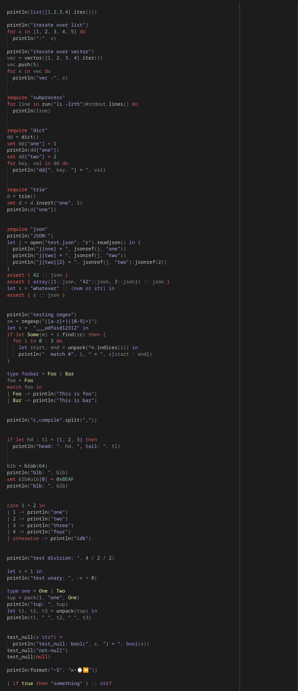

*the work is in a rather early stage, and probably not ready for production*

# Prelude

I have a dream of creating some perfect kind of programming language that is as
all-rounded as C++, as powerful as Scheme, and as simple as Python. This project
is my yet-another-iteration towards this impossible goal.

In the folder ./osl, you can find the language built on top of the Opium-engine:
**O**pium **S**cripting **L**anguage (OSL). Syntax highlighting for VS-Code is
available in some of my other repos on GitHub. OSL "compiles" into scheme
scripts meant to be run or compiled by [Chicken scheme](https://call-cc.org/).
Apparently, scheme is a decent assembly*esque* target. I will not be surprised
when I see a [6GL](https://en.wikipedia.org/wiki/Programming_language_generations)
running on some dialect of Lisp.

This repository consists of two projects:

- [Opium](#opium) - type-system engine;
- [OSL](#OSL) - statically typed programming language that explores possibilities
  and limitations of the symbolic logical type system.


## Building the Projects
<u>**NOTE:** At the moment only the 64 bit x86_64 system is supported.</u>
```bash
# Make sure the requirements are there
git submodule update --init

# Create a build directory
mkdir build

# Configure the project
cmake -B build -S . -DCMAKE_INSTALL_PREFIX=./install

# Build the project
make -C build -j            # ;]
```


# Opium

The subject of this project is developing an ultimate type system engine.
Where *ultimate* stands for the ability to solve a problem of assigning types for
code units (expressions) of arbitrary code, inferred from an arbitrary programming
language with whichever programming idioms it had chosen.

The inherent issue of solving the problem of type assignments is the rise of
ambiguities. This is especially prevalent when the language exposes generic
functions or allows for function name overloading.

In C++, with the introduction of concepts, it became possible to restrict template
parameters to types that definitively satisfy some particular set of expressions.
This allows disambiguation of templated overloads not only by the apparent signatures,
but also by the code units (expressions) themself. In Opium, functions are, by
construction, concepts of themselves. Rust language features some degree of automatic
backwards-type-deduction; however, it also completely prohibits function overloading.
Haskell features one of the most robust type systems to date. However, even Haskell
has some weird limitations (besides the lack of name overloading).

I don't like the presence of compromises in all the languages (all I'm familiar with)
unless there are real reasons behind them. I respect the "for historical reasons"
kind of arguments, but history goes on, and only C++ seems to be bold enough
to be actually pushing the boundaries towards the absolute point of "do everything
that is possible, because why not". But this point hasn't been reached just yet.
And instead of waiting, I hope Opium can shed some light on the
"...*that is possible*..."-part.

What do I look at:
- What are the permissible implicit operations on types that don't lead to ambiguities. 
- The more job is put on the typecheck, the more computations it will be forced to do, the
  longer compilation time it requires, and up to a point when it becomes impractical.
  In this way, computation time happens to impose limits on a practical type system. <br/>
  &Rightarrow; The type system has to be such that compilation times scale at most linearly
  with the size of the program.
- $$\textcolor{red}{\textnormal{\textbf{TODO}}}$$


## Implementation

The typecheck is implemented over a symbolical computation system ([see below](#prolog-engine)),
allowing to attack the problem in a strict logical/algebraic formalism.

### Prolog engine

Opium implements a tweaked variant of the Prolog system. The *tweaks* are addressing
issues such as solving recursive/self-referencing problems that normally result in
unbound computations, and preemptive elimination of solution-branches that would lead
to equivalent results. These are implemented by automatic
[*green cuts*](https://en.wikipedia.org/wiki/Cut_(logic_programming)) in the
choice-points of the Prolog interpreter.

# OSL
## Rationale

- Scheme language is, by construction, among the most powerful systems for programming, period.
  The only competitors that would argue about this title are procedural dialects of Lisp, like
  Common Lisp. However, I believe it is important to remember the old saying: "With great power
  comes great responsibility". And so, unlike the procedural Lisp, Scheme respects the order
  and the value of limits. After all, one of the tasks of a programming language is to drive
  away the programmer from writing inanities.

- Then why don't we see Scheme or other Lisps in wide use nowadays?
  Scripting: 
  1. difficult to read syntax;
  2. outdated legacy paradigms.
    
  Consequently, a smaller community and thus fewer libraries.

  General programming:
  1. dynamic typing;
  2. dynamic variables;
  3. ubiquitous macros and trickery with execution flow.
    
  Combine these, and you get a ticking time bomb that won't even know itself
  it's about to implode.

  With this being said, it would be worth a try to revive the Scheme in a more digestible
  package.

- Type system is essential to bring order to the program. But I don't believe it has to be
  putting constraints in such amounts that a programmer can't even achieve a SEGFAULT. After
  all, the true logic and intentions of the program are not for the compiler to comprehend.
  It only has to be strong enough to make the programmer confident that whatever logic he
  put in the code will indeed be the one he observes when running the program. Only the
  objective typos and ambiguities need to be reported to the programmer.

- Metaprogramming, in the sense of exploiting a type system for code generation, is nowadays a
  well-known and widely accepted tool. Thus, a type system has to be designed such that it will
  assist with metaprogramming in making it
  1. easy to use/implement (make as many things available out-of-the-box as possible);
  2. easy to read (in the sense of code expressiveness).
 
  In short, if we are programming with types, let us then use a type system that is
  designed to be programmed. 

## Features
- $$\textcolor{red}{\\textnormal{\textbf{TODO}}}$$

Some completely arbitrary and even not advertorial code in OSL:



